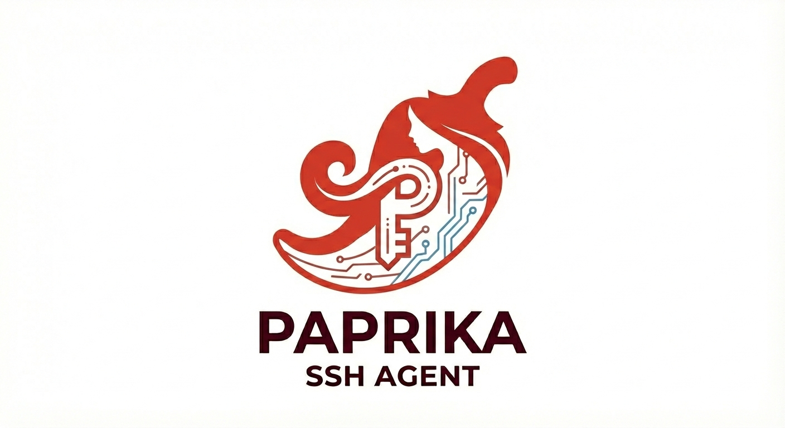
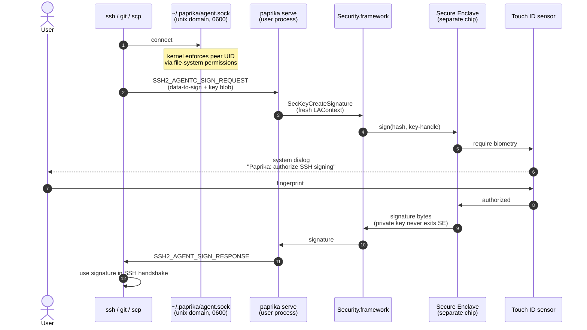

<p align="center">
  
</p>

<p align="center">
  <a href="https://github.com/klobucar/paprika/actions/workflows/ci.yml"></a>
  
  
  <a href="LICENSE"></a>
</p>

# Paprika

A Secure Enclave SSH agent for macOS that lives entirely in your terminal.

Paprika is an **SSH key manager** first and foremost. It generates SSH keys inside the Secure Enclave (they never leave, not even into RAM), manages them through the standard `ssh-agent` protocol, and requires a fresh Touch ID authentication for every single signing operation.

Any tool that invokes `ssh` as a subprocess gets hardware-backed keys for free, because the `ssh` binary is what reads `SSH_AUTH_SOCK`. This covers most of the command-line ecosystem: `ssh` itself, `git` (via `core.sshCommand`), `scp`, `rsync`, `mosh`, and Ansible's default SSH transport. Tools with their own **in-process** SSH implementations — GUI git clients built on libgit2 (e.g. Tower, GitKraken, GitHub Desktop), IDE plugins that embed their own SSH stack, and anything using `go-git` or `JGit` — do **not** route through the agent and will not work with Paprika. If in doubt, check whether your tool exec's `/usr/bin/ssh` under the hood.

Git commit signing is an excellent side benefit: because Paprika serves the same keys over the agent protocol, `git commit -S` and `git log --show-signature` work against Secure Enclave keys with no extra plumbing. The signing is hardware-bound, Touch ID-gated, and — to our knowledge — as strong as anything a macOS command-line tool can offer.

---

## Why Paprika instead of Secretive?

[Secretive](https://github.com/maxgoedjen/secretive) is excellent and the right tool for most people. Paprika is for a different workflow:

| | Paprika | Secretive |
|---|---|---|
| Interface | CLI daemon | GUI menu bar app |
| Requires GUI login session | No | Yes |
| Scripting / dotfiles | `paprika generate mykey` | Manual clicks |
| Codebase size | ~600 lines of Swift | Much larger |
| One-line Git signing setup | `paprika git-setup --global` | Manual |

Both tools still require a human finger on a Touch ID sensor for every sign. Neither is suitable for fully unattended "headless" signing — see [Paprika is not for unattended automation](#paprika-is-not-for-unattended-automation) below.

**Choose Paprika if** you live in the terminal, manage Macs with Ansible or bootstrap scripts, or want a launchd agent with no GUI dependencies that starts before you log in. The CLI-first model composes naturally with dotfiles, scripts, and SSH config.

**Choose Secretive if** you want a polished GUI with a dedicated Touch ID dialog that names the requesting application. Secretive has years of production use and a much larger user base.

---

## Paprika is not for unattended automation

Paprika is designed around a single assumption: **every signing operation has a human present who is willing to authenticate.** The Secure Enclave enforces this in hardware. There is no caching, no "trust this machine," no "sign the next 50 things without asking." If you think about SSH keys in terms of "my CI system pushes tags to Git," Paprika is the wrong tool.

Specifically, **Paprika is not suitable for**:

- **Unattended servers** — a Mac mini running as a build machine, a CI runner, a fleet automation box. No human is at the keyboard, nobody will answer the Touch ID prompt, every sign hangs until someone does.
- **Background services signing on a timer** — cron jobs that auto-sign artifacts, `git push` from a scheduled launch agent, any form of "sign something every 5 minutes without asking."
- **Headless Macs with no Touch ID sensor** — a Mac mini without a Touch ID-equipped keyboard cannot even generate Paprika keys. The access control policy requires biometry, and there's no hardware to provide it. (A `--auth=passcode` option that falls back to device passcode is possible and would remove the *sensor* requirement, but it still requires a human to *type the passcode*, so it doesn't solve the underlying problem.)
- **Any workflow where "no prompt" is a feature, not a bug.**

For any of those, use a tool whose design matches your threat model:

| Need | Use this instead |
|---|---|
| Unattended signing on a Mac or Linux server | **[YubiKey](https://www.yubico.com/)** with touch-required bypass or PIN caching — hardware-backed, but policy-adjustable |
| CI signing in the cloud | **[AWS KMS](https://aws.amazon.com/kms/) / [GCP Cloud KMS](https://cloud.google.com/security/products/security-key-management) / [Azure Key Vault](https://azure.microsoft.com/en-us/products/key-vault)** — remote HSMs with service account auth |
| TPM-backed keys on Linux | `ssh-tpm-agent` or similar |
| Headless CI / build farm | **Whatever your CI provider offers for secret management** |

Paprika's only job is to be the SSH agent for *you, personally, at your laptop, right now, with a finger ready.* That's a real use case and we lean into it hard — but it is a narrow one. Know which one you're in.

---

## Status: pre-release

Paprika is **pre-0.1**. This repository is **source only**:

- There is **no signed, notarized release binary** yet.
- There is **no Homebrew tap**, no published tarball, no installer.
- The code in `main` builds cleanly and the tests pass, but **running it on your own Mac requires signing and provisioning work** described below.

The public distribution story (`brew install paprika` → notarized binary → everything just works) is on the roadmap, not shipped. Specifically, the remaining work is: request a Developer ID Application certificate, register an App ID on developer.apple.com, generate a Developer ID provisioning profile, wrap the binary in a `.app` bundle, notarize with `notarytool`, staple, publish to GitHub Releases, write a Homebrew formula.

If you clone this today, treat it as a source-level preview and an exercise in how SE-backed SSH agents get built on macOS. If you want to help with the release pipeline, that's an excellent contribution area — open an issue.

---

## Requirements

- macOS 14+
- A Mac with Secure Enclave (any Apple Silicon Mac, or Intel Mac with T2 chip)
- A **paid Apple Developer account** — not optional. Secure Enclave keychain access requires a stable team identifier baked into the code signature, and macOS enforces this with AMFI at process exec time. Ad-hoc signing (`codesign --sign -`) will fail with `errSecMissingEntitlement`; `Apple Development` cert + bare `codesign` will be SIGKILLed at launch.

---

## Installation (building from source)

### The short story

macOS's Secure Enclave access rules are strict: to create and use persistent SE keys, the binary must be code-signed **and** accompanied by a provisioning profile that authorizes the `keychain-access-groups` entitlement. For a bare command-line Mach-O binary, this means wrapping it in a minimal `.app` bundle and embedding the profile at `Contents/embedded.provisionprofile`.

### One-time setup

1. Clone and build:

   ```bash
   git clone https://github.com/klobucar/paprika.git
   cd paprika
   swift build -c release
   ```

2. In Xcode, create a throwaway macOS **App** target with bundle identifier `com.paprika.agent`, set the signing team to your Apple Developer team, and enable the **Keychain Sharing** capability. Build it once (⌘B). Xcode will register the App ID on developer.apple.com and generate a **Mac Team Provisioning Profile** containing `keychain-access-groups = <teamid>.*`. The profile lands at `~/Library/Developer/Xcode/UserData/Provisioning Profiles/<uuid>.provisionprofile`.

3. Wrap the built binary into a bundle, embed the profile, sign with Apple Development cert + the four required entitlements (`com.apple.application-identifier`, `com.apple.developer.team-identifier`, `keychain-access-groups`, `com.apple.security.get-task-allow`), and test. See `scripts/codesign.sh` in the repo history for a working example — it's not committed because it's inherently team-specific, but it documents the exact invocation.

4. The resulting `Paprika.app/Contents/MacOS/paprika` will run locally on your Mac. It will not run on other Macs because the provisioning profile is limited to devices registered in your development team. For distribution across Macs, the roadmap (Developer ID + notarization) applies.

### Install as a background agent

```bash
# After signing Paprika.app, point launchd at the inner binary:
.build/release/Paprika.app/Contents/MacOS/paprika install

# Load immediately (also runs at login via launchd)
launchctl bootstrap gui/$UID ~/Library/LaunchAgents/com.paprika.agent.plist
```

Add to your shell profile (`.zshrc`, `.bashrc`, etc.):

```bash
export SSH_AUTH_SOCK="$HOME/.paprika/agent.sock"
```

---

## Usage

The primary workflow is: generate a key, copy the public half somewhere that accepts SSH keys (a server's `authorized_keys`, GitHub, GitLab, a Git host, a cloud instance), then use `ssh` / `git` / `scp` / `rsync` normally. Paprika handles the rest.

### 1. Generate a key

```bash
paprika generate github
paprika generate prod-bastion
paprika generate work-laptop
```

The private key is created inside the Secure Enclave and is permanently non-extractable — it cannot be copied, backed up, or exported. Key **generation** does not prompt Touch ID (the SE only records the access-control policy); Touch ID is required for every key **use** (signing), which you'll see the first time `ssh` or `git commit -S` reaches for the agent.

### 2. Copy the public key somewhere useful

```bash
# Print in ssh-keygen format:
paprika show github

# Pipe straight into a remote authorized_keys:
paprika show prod-bastion | ssh bastion 'cat >> ~/.ssh/authorized_keys'

# Or copy to clipboard for pasting into GitHub/GitLab:
paprika show github | pbcopy

# SHA256 fingerprint (for GitHub/GitLab key verification pages):
paprika show github --fingerprint
```

### 3. Use it

No SSH config changes needed. As long as `SSH_AUTH_SOCK` points at Paprika (see Installation above), every tool that uses SSH authentication will route through Paprika:

```bash
ssh prod-bastion            # Touch ID prompts, then you're in
git push origin main        # Touch ID prompts, then pushes
scp ./file bastion:~/       # Touch ID prompts, then transfers
rsync -av src/ bastion:dst/ # Touch ID prompts, then syncs
```

You'll see a Touch ID prompt the first time in a session and on every signing operation — there is no authentication caching.

### Working from a headless Mac via SSH agent forwarding

Can Paprika run on a headless Mac mini? No — but you might still want to use it *from* one. **You don't run Paprika on the Mac mini; you run it on your laptop and forward the agent socket** to the mini through SSH. Paprika's security model requires a human finger on a Touch ID sensor for each sign, so the agent has to live on the machine with a finger available. The headless machine becomes a *client* of your laptop's agent, not a host of its own.

The standard SSH agent forwarding flag is `-A`:

```bash
# On your laptop (where Paprika runs):
export SSH_AUTH_SOCK="$HOME/.paprika/agent.sock"

# SSH to the Mac mini with agent forwarding enabled:
ssh -A minimac

# Now, on minimac, SSH_AUTH_SOCK is a tunneled socket back to your laptop.
# Any git/ssh/scp operation on the mini will transparently reach Paprika:
git push origin main         # Touch ID prompts on YOUR LAPTOP, not the mini
ssh deploy@other-server      # Same — prompt appears on the laptop
```

Typical setup: your laptop with Touch ID is the agent host, the Mac mini (or Linux box, or any remote system) is the workstation or build server, and signing authority stays physically bound to you. This is the workflow Paprika is actually built for. `-A` is also how you chain through jump hosts — every hop back to the laptop is valid as long as the chain stays up.

**Warning about agent forwarding:** SSH agent forwarding means any user who compromises root on a forwarded host can use your agent socket to sign things while your session is active. This is a long-standing SSH caveat, not a Paprika-specific one, but it's worth naming. Forward only to hosts you trust; prefer `-J` (ProxyJump) over `-A` when you don't need the downstream machine to use the agent itself.

### Deleting a key

```bash
paprika delete github
```

This destroys the key in the Secure Enclave. **There is no recovery** — the private key no longer exists anywhere in the universe.

### Bonus: Git commit signing

Because the same SSH keys are served over the agent protocol, Git can use them to sign commits with zero extra setup:

```bash
# Auto-detects your key if you only have one:
paprika git-setup --global

# Specify a key by name:
paprika git-setup --global github

# Also add to ~/.config/git/allowed_signers (so `git log --show-signature` verifies):
paprika git-setup --global --add-to-allowed
```

Every `git commit -S` will now prompt Touch ID and produce a hardware-bound, Secure Enclave-backed signature. Your Git history becomes provably authored by someone with physical presence at your Mac.

---

## Architecture

### Why the Secure Enclave?

A traditional SSH key lives in `~/.ssh/id_ed25519` with mode `0600`. That file is readable by any process running as your user: your shell, your editor, your terminal multiplexer, a browser subprocess that escaped its sandbox, an `npm postinstall` script, a VS Code extension, a `curl | bash` from a stale tutorial. `chmod 0600` is not a security boundary against code running as you — it's a label.

The [**Secure Enclave**](https://support.apple.com/guide/security/secure-enclave-sec59b0b31ff/web) is a dedicated hardware security coprocessor baked into every Apple Silicon Mac (and T2-generation Intel Macs). It runs its own sealed operating system on a physically separate chip that the main CPU cannot inspect, with its own memory the kernel cannot read. Keys generated inside the Secure Enclave have four properties that no file-based key can match:

1. **Created in the SE.** `SecKeyCreateRandomKey` with `kSecAttrTokenIDSecureEnclave` generates key material *inside the SE hardware*. The private key bytes never exist in the main CPU's memory at any point, not even for a microsecond. Userspace only ever holds an opaque handle.
2. **Cannot be exported.** There is no API — public, private, or `@_spi` — that returns raw private key bytes for an SE-backed key. The SE will sign things for you, but it will not hand over the material. `paprika delete` does not copy the key out; it tells the SE to forget it.
3. **Bound to this specific Mac.** The SE encrypts its stored keys with a hardware-fused root key unique to the SoC. You cannot move an SE-backed key to another Mac, and a kernel-level exfiltration attack on your Mac cannot produce anything usable off-device.
4. **Require Touch ID per use** (with `.biometryCurrentSet`). Every signing operation invokes the Secure Enclave, which invokes the Touch ID sensor, which prompts you. No authentication caching. No session reuse. No "allow forever" checkbox. Enrolling a new fingerprint after key creation invalidates the key — so an attacker with brief physical access to an unlocked Mac cannot silently gain persistent signing authority.

For the complete treatment, see Apple's [Platform Security Guide](https://support.apple.com/guide/security/welcome/web) — the Secure Enclave chapter covers the hardware design, boot attestation, and the key protection hierarchy in detail.

**Translation:** malware with full user-level code execution on your Mac cannot extract a Paprika key. It can ask the agent to sign arbitrary data, but you will see a Touch ID dialog and can refuse. That's a strictly better security story than a `0600` file, at the cost of requiring physical presence for every signing operation — which was the goal.

### Signing flow



A few things worth pointing out about what is **not** in this flow:

- **The private key never transits any box except "Secure Enclave."** The `Security.framework`, `paprika serve`, the Unix socket, and the SSH client never touch key material — only signatures.
- **The Touch ID dialog is drawn by the OS**, not by paprika. Paprika cannot spoof it, style it, or inject text into it. An attacker impersonating the agent cannot fake a Touch ID prompt.
- **`paprika serve` runs as an unprivileged user process.** It is not a kernel extension, not a root daemon, not a system service. Its only entitlement beyond the standard cert is `keychain-access-groups`, which scopes which keychain items it can see — not what it can do to the system.
- **The socket is the trust boundary.** The kernel enforces it via file-system permissions (`0600` file under a `0700` directory owned by you). No userspace ACL check, no `getpeereid` gymnastics — just `chmod`.

---

## Security model

- **Non-extractable keys**: Keys are `kSecAttrIsExtractable: false` and generated directly inside the Secure Enclave. The private key material never exists outside the SE, not even in RAM.
- **Touch ID on every signing operation**: Paprika creates a fresh `LAContext` per signing request. There is no authentication caching — each SSH, Git, scp, or rsync operation requires fresh physical presence.
- **Current-biometry binding**: Keys are generated with `.biometryCurrentSet`, so enrolling a new fingerprint after key creation invalidates the key. An attacker with brief physical access to an unlocked Mac cannot silently gain persistent signing authority.
- **File-system peer authentication**: The Unix socket at `~/.paprika/agent.sock` is `0600` under a `0700` directory, both re-enforced on every start. Only the process owner can `connect(2)` — no other local user can reach the agent.
- **Bounded message handling**: Incoming agent messages are capped at 256 KB. A malicious local client cannot force unbounded memory allocation by claiming a gigabyte-sized frame.
- **No network access**: Paprika listens only on a Unix domain socket. It never opens a TCP/UDP port.
- **Protocol**: Implements `SSH2_AGENTC_REQUEST_IDENTITIES` (11) and `SSH2_AGENTC_SIGN_REQUEST` (13) from the [SSH agent protocol](https://www.ietf.org/archive/id/draft-miller-ssh-agent-04.txt). Signatures are ECDSA P-256 (`ecdsa-sha2-nistp256`).
- **Crypto**: `CryptoKit` and the `Security` framework. No third-party crypto dependencies.

### Threat model

Paprika protects your SSH private keys from:

- Exfiltration by malware with user-level access (keys never leave the Secure Enclave)
- SSH agent hijacking by another local user (socket is 0600; parent dir is 0700; ownership verified at startup)
- Silent signing — every operation requires a fresh Touch ID authentication
- Attackers who briefly touch an unlocked machine to enroll a new fingerprint (keys become invalid on biometry set change)
- Memory exhaustion via oversized agent frames

Paprika does **not** protect against:

- An attacker who can present *your* finger to the sensor
- A compromised OS kernel or Secure Enclave firmware
- An attacker already executing code as your user while your session is unlocked and actively authenticated (they will still need Touch ID for each signature, so they cannot sign silently — but they can prompt you and hope you approve)
- An ad-hoc signed binary: keychain access group isolation depends on a proper Developer ID. For production use, sign the release binary with your team ID.

---

## Logs

Paprika routes daemon diagnostics through the macOS unified log system (subsystem `com.paprika.agent`). Automatic rotation, privacy redaction, and rich filtering are handled by the OS.

```bash
# Live-tail the daemon (like `tail -f`):
log stream --predicate 'subsystem == "com.paprika.agent"'

# Historical events from the last hour:
log show --predicate 'subsystem == "com.paprika.agent"' --last 1h

# Only errors:
log show --predicate 'subsystem == "com.paprika.agent" && messageType == error' --last 24h
```

---

## AI Honesty

Parts of Paprika were written with [Claude](https://claude.com/claude-code) as a pair-programmer — design discussions, SSH agent protocol wiring, Secure Enclave access control, test scaffolding, and this README itself. Every line was reviewed, tested, and accepted by a human before landing. This note exists because attribution belongs somewhere readers can see it, not buried in commit trailers.

## License

MIT
